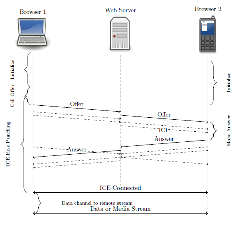
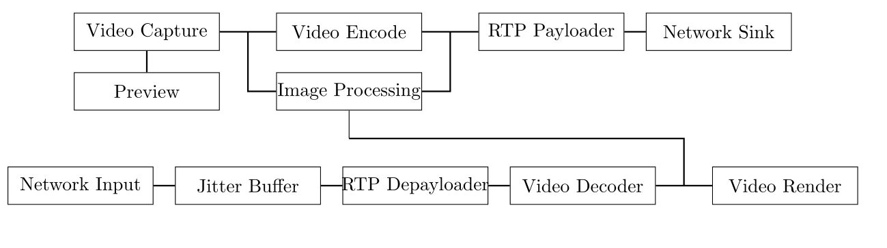
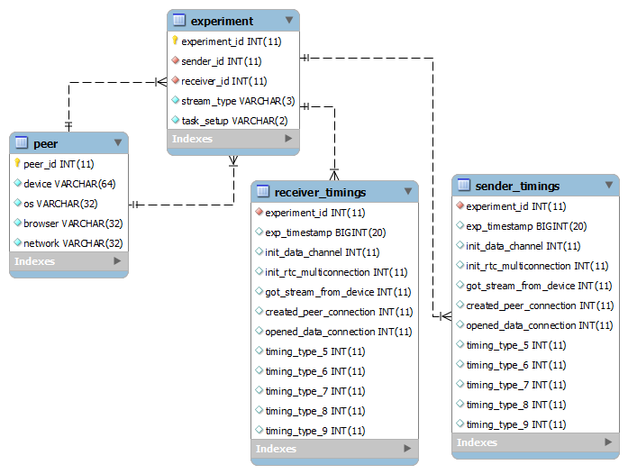

## WebRTCBench

## Overview
WebRTC is an industry and standards effort to provide real-time communication capabilities into all browsers and make these capabilities accessible to software developers via standard HTML5 and Javascript APIs [1].
WebRTC fills a critical gap in web technologies by allowing (a) the browser to access native devices (e.g., microphone, webcam) through a Javascript API and (b) to share the captured streams through using browser-to-browser Real-Time Communication. WebRTC also provides data sharing.
### WebRTCBench in a Nutshell
The goal of WebRTCBench is to provide a quantitative comparison of WebRTC implementations across browsers and devices (i.e., hardware platforms). WebRTC accomplishes three main tasks: Acquiring audio and video; Communicating Audio and Video; Communicating Arbitrary Data. The
se tasks are mapped one to one to three main Javascript APIs. These are as follows: MeadiaStream (i.e., getUserMedia); RTCPeerConnection; RTCDataChannel. Hence, a quantitative assessment of WebRTC implementations across browser and devices is performed via collecting performance of MediaStream, RTCPeerConnection, and RTCDataChannel.
Because a MediaStream contains one or more media stream tracks (e.g., Webcam and Microphone), WebRTCBenc allows to define MediaStreams composed of Video, Audio, Data and any combination thereof. Likewise single peer connection with web server and multiple peer connections between browsers are supported in a WebRTC triangle [1].
### What Is Included ?
This release is composed of two components:
1. a web server based on socket.io [2]
+  a HTML5 WebRTC application

#####Webserver:
Benchmark comes with a Webserver which when run, allows clients to download the WebRTC application and perform the signaling. Furthermore, it is used to integrate a database.


#####WebRTCBench application:
An HTML5 application that can acquire streams, open peer connections, and both streams and data sharing. It can  perform testing and performance measuring of important functionalists of WebRTC implementation including call establishment and media engine.


### WebRTCBench 2
This version of WebRTCBench adds performance measuring of media engine pipeline and data channels.

### WebRTCBench 1
This version of WebRTCBench provides WebRTC call performance measurement including capturing media devices, creating WebRTC objects, signaling and hole punchings. It has an automated mechanism to collect experiment information from peers' browsers within text format and also in rational database. Collecting information is currently limited to connection between only two peers. Also, web server can provide a secure connection.


## Getting started

This section illustrates how to install and execute the web server; how to set up the database and how to work with the benchmark. Web server and database can be installed both on Linux and Windows based machines.

### Setting Up and Starting the Web Server

The web server is based on Node.js; After obtaining Node.js binary from http://nodejs.org/download/, enter into the directory webrtcbench-code and execute the following command.
```bash
    $npm install express async mysql socket.io
```
To start the web sever use the following command (On Unix/Linux machines the user issuing the following command must be root or a sudoer):
```bash
    $node socket-server.js > socket-server.log &
```

The web server will be listening to the socket indicated during its configuration. To stop the signaling server, use the following command on Unix/Linux machines:
```bash
    $kill -9 `pidof node`
```
or press "Cntrl+C" on Windows machines.


### Setting Up The Database
At this step, you should have a version of MySQL database installed on your machine. In order to create the database, a MySQL database user with sufficient privileges should execute the "createdb.sql" script provided by the benchmark using the following command in MySQL console.
```bash
    $source createdb.sql
```
By executing this command a database called "webrtcdb" --if does not already exist-- will be created. After creating the database, the following modifications should be made to "config.js" configuration file.
1. Make sure that "db.present" variable is set to true
+ parameters regarding database address and authentication is set properly. Note that regardless of database presence, timing information will always be saved into text files on the web server.
```js
    db.present = true;  // DB is present
    db.host = 'localhost';
    db.user     = 'user' ;
    db.password = 'pass' ;
    db.database = 'webrtcdb' ;
```

### User Guide
To use WebRTCBench, a user has to open multiple instances of a browser and navigate to the benchmark's hosted location. For example, if the benchmarks hosted location is host.example.com, open a browser and access the benchmark home page at the URL http://host.example.com.
User should provide its own machine specification at "User Agent Info" section menu. These specification include: device type, processor, connection type. By pressing "Remember Information" button the provided specification will be stored in browser cache and will be restored in later uses. Once at the benchmark home page, a user can select any combination of audio, video, or data in the connection type box, choose a channel id or number to open, and then select "Open Channel". To add a peer connection, input the opened channel id or number into the channel name of a new browser; then input the connection type into the appropriate box. A connection of the selected type will then be opened between the two browsers.
If an audio/video connection is selected, a prompt will appear to ask the user permission for accessing the corresponding devices; the user must allow access for the application to work properly. If the connection between browsers and web server is secure, browsers will remember user permission when accessing that website.
Multiple audio and video connections can be created by navigating the home page and joining channels from different browsers. If a data connection is opened, any user can send a text message or send a file to other users by using the appropriate web forms.
Information about completion time for operations related to MediaStream, RCTPeerConnection and RTCDataChannel is displayed in the console below the application. If "Sending timings to Server" is enabled in GUI, information will be sent to server and will be stored in text files named in the format "$channel_no.txt" where $channel_no is the channel number for that connection. Additionally if configured, those information can be stored in the database for further analysis. Currently, only experiments involving two peers can be inserted in the database.

### Supported Browsers
* Chrome 25.0+ (28.0+ for best performance)
* Firefox 22.0+
* Chrome 29.0+ on Android

## Developer Guide
Socket.io [2] and Node.js are used to implement and execute the web server. Additionally, following Node.js modules are used:
express
node-mysql
async
We have used community edition of MySQL to set up the database. If using a different database is amenable, a different adapter should be provided in server code.

### WebRTC Events
A list of WebRTC events are defined in js/events.js file. WebRTC application will use them for logging.

```javascript
        exports.Events = {
		CREATING_PC : "Creating RTCPeerConnection object",
		PC_CREATED : "RTCPeerConnection object created",
        GETTING_MEDIA: "Getting user media",
        LOCAL_MEDIA_CAPTURED: "Local media captured",
        LOCAL_PLAYBACK_STARTED:"Local media playback started",
        REMOTE_STREAM_ARRIVED: "Remote stream arrived",
        REMOTE_PLAYBACK_STARTED: "Remote playback started",
        CREATING_DATA_CHANNEL: "Creating Datachannel object",
        DATA_CHANNEL_OPENED: "Datachannel opened",
        CALLEE_ARRIVED : "Callee arrived",
        CREATING_OFFER : "Creating offer",
        OFFER_CREATED : "Offer created" ,
        CREATING_ANSWER: "Creating answer",
        ANSWER_CREATED: "Answer created",
        SETTING_REMOTE_DESCRIPTION: "Setting remote description",
        REMOTE_DESCRIPTION_SET : "Remote description set",
        NEW_ICE_CANDIDATE: "On new ICE Candidate",
        CONNECTING_TO_SIGNALLING_SERVER: "Connecting to signaling server",
        CONNECTED_TO_SIGNALLING_SERVER : "Connected to signalling server",
        ICE_CONNECTED : "ICE Connected"
	};
```
##### Logging events
```javascript
    var eventLogger = {
      info :  function(event, timestamp){
      } ,
      verbose :  function(event, timestamp) {
      }
    };
```

* This is a client-side object which provides two functions that insert an event into a events dictionary. Both methods require two parameters: "$timestamp" is the measured time and will be stored in dictionary location indexed by "$event" type.
+ Events inserted using verbose method will be printed on console only in verbose mode.
+ Events dictionary will be sent to server later at the end of experiment.
+ Server will measure WebRTC performance by interpreting these events according to WebRTC connection establishment flow.




### MeidaEngine Stats
Following picture depicts the components that are found in WebRTC media engine implementations. Our benchmarking application collectes exposed statistics regarding each component for video calls. For example frame rate, bit rate , video resolution output of both video encoder and decoder,  amount of data/packets being transfered over network are recorded.



### WebRTCBench Using HTTPS Connection
When connected through HTTPS, media access permission granted to WebRTC application will be persistant for that particular web site (Firefox doesn't support persistant permission yet). Hence, the time measured to "Get user media" would exclude human interaction and would be more accurate. To enable web server to accept HTTPS connections, a certificate and key file should be provided. These files can be generated by tools such as OpenSSL. The following java script code shows how to create a node server with HTTPS support given certificate and key files.

``` javascript
    var https = require('https');
    var options = {
        key: fs.readFileSync('./server.key').toString(),
        cert: fs.readFileSync('./server.crt').toString()
    };
    var securePort = config.ws.securePort;
    server = https.createServer(options,app).listen(securePort);
```

## WebRTCBench Database
This section describes the database that is used to store experiments information.

### Database Structure
WebRTCBench database as depicted as follows is composed of four tables. Fields with yellow key sign (e.g. experiment_id and peer_id in peer table) are uniquely assigned by the database engine. Database tables are briefly explained here:


1. Peer: An entry of this table represents a client(peer) involved in experiment. Each entry has four fields:
device: Client Device Type( e.g. Mobile/PC)
os: Client Operating System
browser: Client Browser
Network: Client Network type ( e.g. LAN,WIFI)

2. Experiment: Each entry of this table represents an experiment conducted between two specific peers specified by sender_id and receiver_id.
stream_type: Type of stream
3 characters 'A', 'V' and 'D' represents Audio, Video and Data respectively. For connection with multiple streams a combination of letters will be used. e.g. 'AV' for 'Audio+Video'.
task_setup: Task setup( e.g. PC)

3. sender_timings and receiver_timings:


### Database adapter
File db.js provides the following function for database integration.

```javascript
    function addExperiment(connection,sender,receiver,streamType,taskSetup)
```
* This is a server-side function which inserts experiment information into database. It should be called when all experiment information from two peers are collected.
+ First, sender and receiver peers information will be inserted into peer tables (if not already in there. Peers are identified by their agent information: processor, browser, ...)
+ Inserts an experiment involving two peers from previous step (only if such experiment does not exist already).
+ sender and receiver timings table will be filled using data fields from sender and receiver objects accordingly.  

### Adding measurements to database
The following steps describe how to add another measurement to WebRTC benchmark:

1. Add the new event to "EVENTS" variable in "events.js" file if does not already exists. Entries in "Events" have the following structure:
  ```javascript
          $Id : "text"
  ```
  when $Id is a unique identifier for that entry and $text is textual representation of event.

+ Use a reserved column in the sender_timings and receiver_timings. Execute the following command in MySQL console to rename the column name.

  ```mysql
          ALTER TABLE sender_timings CHANGE timing_type_i new_name INT;
          ALTER TABLE receiver_timings CHANGE timing_type_i new_name INT;
  ```
+ Modify "addExperiment" function to reflect database changes.
+ After performance measuring of your area of interest with WebRTCBench, call "eventLog" function with event and time parameters.


### References
[1] Alan B. Johnston and Daniel C. Burnett. 2012. WebRTC: APIs and RTCWEB Protocols of the Html5 Real-Time Web. Digital Codex LLC, USA.
[2] Socket.io http://socket.io/
