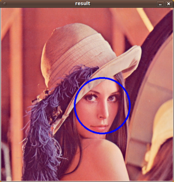

# STEP BY STEP
***

##INSTALL OPENCV2.x

### Required Packages
* GCC 4.4.x or later
* CMake 2.6 or higher
* GTK+2.x or higher, including headers (libgtk2.0-dev)
* pkg-config
* Python 2.6 or later and Numpy 1.5 or later with developer packages (python-dev, python-numpy)
* ffmpeg or libav development packages: libavcodec-dev, libavformat-dev, libswscale-dev
* [optional] libtbb2 libtbb-dev
* [optional] libdc1394 2.x
* [optional] libjpeg-dev, libpng-dev, libtiff-dev, libjasper-dev, libdc1394-22-dev

    	sudo apt-get install cmake git libgtk2.0-dev pkg-config libavcodec-dev libavformat-dev libswscale-dev

### Get OpenCV source
In dir you like, run command 
		
	wget http://sourceforge.net/projects/opencvlibrary/files/opencv-unix/2.4.9/opencv-2.4.9.zip

### Build OpenCV
In the same dir, run command
	
	unzip opencv-2.4.9.zip
	cd opencv-2.4.9
	cmake .
	make
	sudo make install

### Configue lib
	sudo vim /etc/ld.so.conf.d/opencv.conf          
Add 

	/etc/ld.so.conf.d/opencv.conf
 to end of the file, it is OK if this file is empty.
Then run
	
	sudo ldconfig
Next run
	
	sudo vim /etc/bash.bashrc 
And add
	
	PKG_CONFIG_PATH=$PKG_CONFIG_PATH:/usr/local/lib/pkgconfig
	export PKG_CONFIG_PATH

### Opencv Test
	cd ./samples/c
	./build_all.sh
	./facedetect --cascade="/usr/local/share/OpenCV/haarcascades/haarcascade_frontalface_alt.xml" --scale=1.5 lena.jpg
If you see the picture , then OpenCv is installed successfully.

##CONFIGURE NODE

First, in dir WebRTCBench

	cd native
	make

Then, modify **config.js**, add your own mysql **username** and **password**.

Because we now use **node4.x** which is different from versions before, so run 

	npm install body-parser

If everything is OK. You can run 

	sudo node socket-server.js
(because we set default port 80 so root is required).Sometimes you may encounter **caught exception: Error: listen EACCES**, because you run other services on port 80, please stop it to run node.

##Y4m Input
Run command like this:

    "C:\Program Files (x86)\Google\Chrome\Application\chrome.exe" --use-fake-device-for-media-stream --use-file-for-fake-video-capture=C:\Users\zhenchao\Downloads\640.y4m
